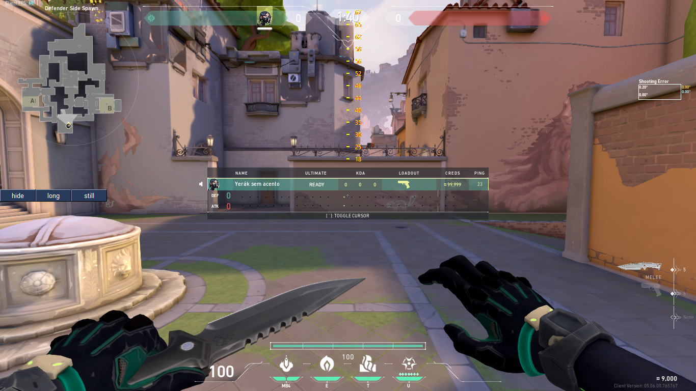
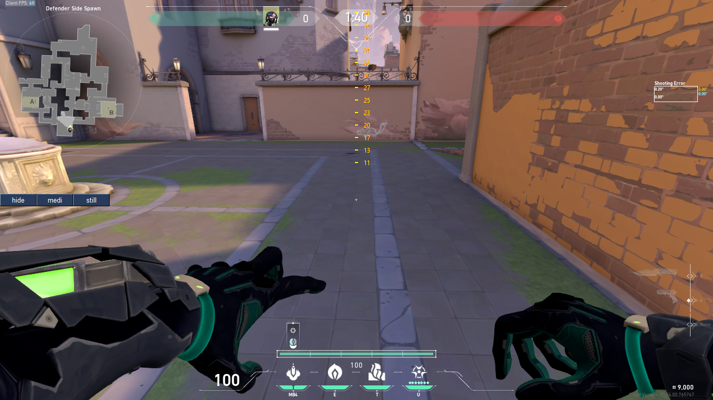
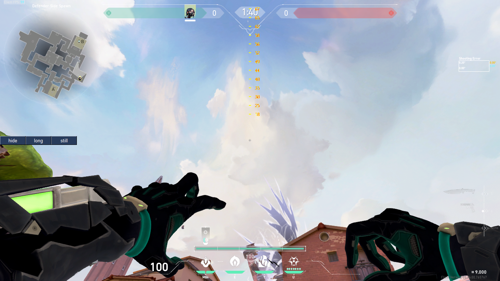

# Valorant Lineup helper

Wing Any Lineup from Anywhere

## Table Of Contents

- [Valorant Lineup helper](#valorant-lineup-helper)
  - [Table Of Contents](#table-of-contents)
  - [About The Project](#about-the-project)
  - [Getting Started](#getting-started)
  - [Usage](#usage)

## About The Project

In Valorant, the points on the map that you memorize to make lineups are all angle-based. So, if you learn how to angle your throwables, you'll be able to do lineups from anywhere with almost any agent

This program just helps you find the angles and their respective distances for the projectiles.

This is ban-free. It does not modify the game or read data.

Some gents have similar throwables, like Viper smoke and Killjoy nano-swarm; a lineup for Viper works perfectly with Killjoy.

[Reference video](https://www.youtube.com/watch?v=kk4y5L4_kxs&t=3s) (this video is not mine)

## Getting Started

run the main file

## Usage

There are three buttons on the left side of the screen:

-The first button: shows or hides the marks.

-second button: Alternate through long-range or medium-range projectiles. Viper poison and Sage slow, for example, are long-range; and Viper smoke and Killjoy are medium-range.

-third button: Alternate between stopping, running, or jumping when throwing. If you set it to "jump", you must jump when throwing.
